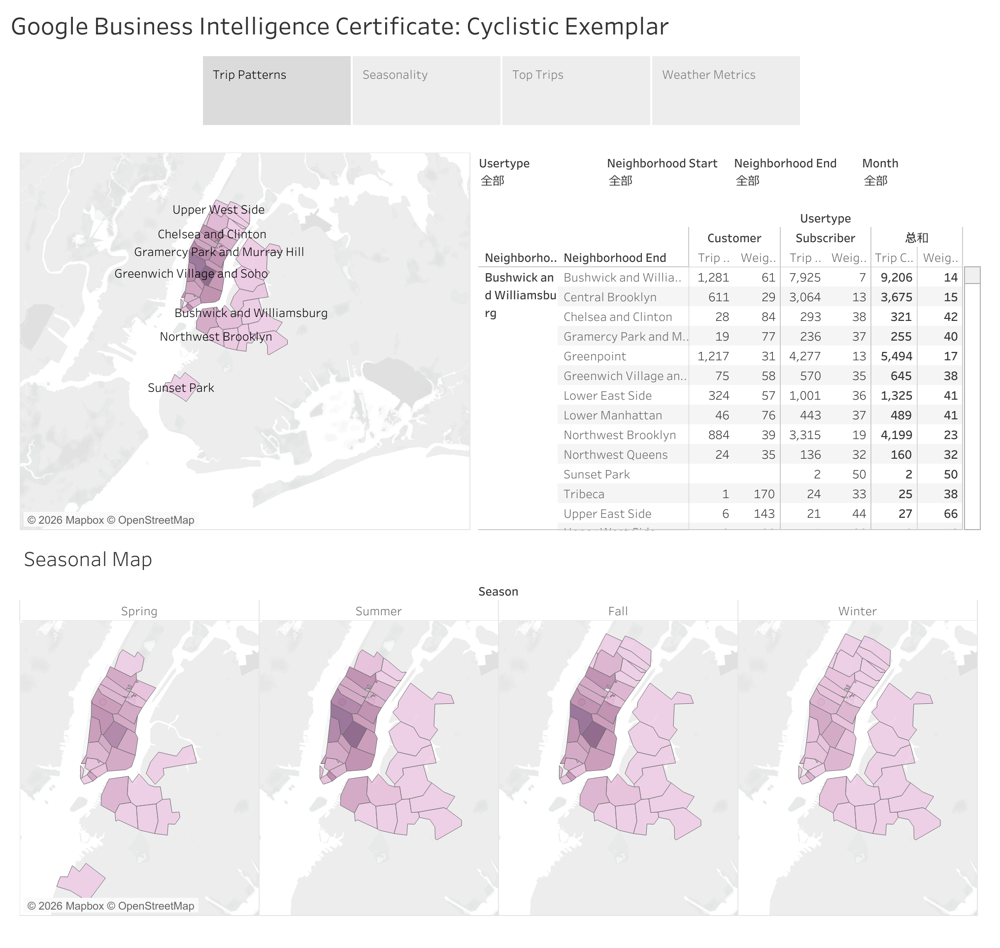
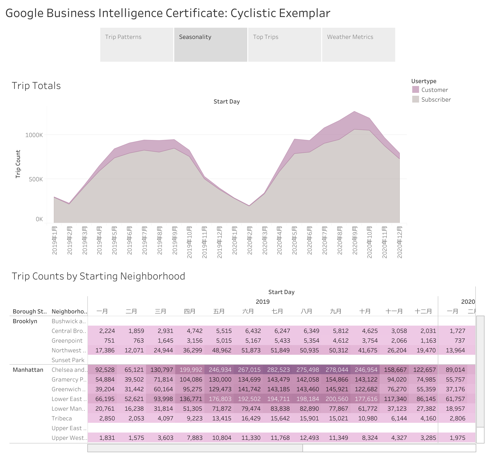
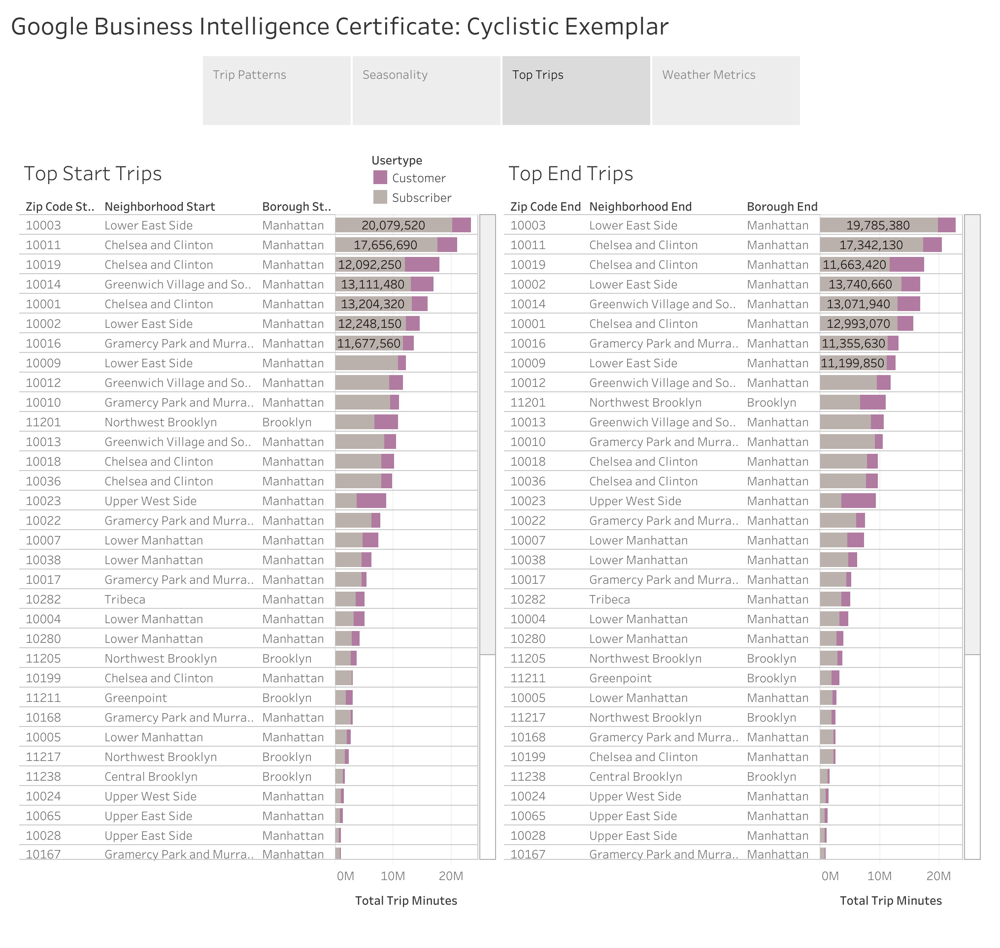
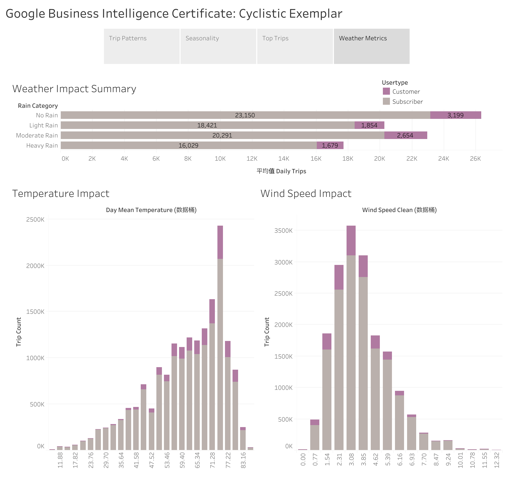

# NYC-CitiBike-Tableau-Dashboard
Google Business Intelligence Certificate: Cyclistic Exemplar

An interactive Tableau dashboard that analyzes NYC Citi Bike usage patterns, seasonal demand, trip behavior, and weather impacts to support operational and marketing decisions.

## Project Overview

This project analyzes the NYC Citi Bike trip dataset using Tableau.

The objective is to discover usage patterns across different boroughs, neighborhoods, user types, seasons, and weather conditions.

The dashboard is designed to answer several business questions:

- Which neighborhoods generate the highest bike demand?
- How do seasonal trends affect ridership?
- Which routes generate the longest travel time?
- How does weather influence bike usage?
- Are subscribers affected differently from casual customers?

---

## 🌐 Live Dashboard

👉 **Explore the interactive dashboard on Tableau Public**
[https://public.tableau.com/views/Cyclistic_17839469593750/1?:language=zh-CN&:sid=&:redirect=auth&:display_count=n&:origin=viz_share_link]


## 📊 Data Sources

| Dataset | Description |
|----------|-------------|
| NYC Citi Bike Trips | Historical bike trip records |
| US ZIP Code Boundaries | Geographic boundaries for borough and neighborhood mapping |
| ZIP Code Lookup Table | Custom dataset uploaded to Google BigQuery |
| NOAA GSOD Weather | Daily weather observations (temperature, wind speed, precipitation) |

**Platform:** Google BigQuery Public Dataset

---

## ⚙️ Project Workflow

```text
Google BigQuery
        │
        ▼
SQL Data Cleaning & Integration
        │
        ▼
Data Aggregation
        │
        ▼
Tableau Dashboard Development
        │
        ▼
Interactive Business Insights
```

---

# 📈 Dashboard Overview

## Dashboard 1 – Geographic Overview



**Purpose**

Visualize seasonal bike demand across New York City boroughs and neighborhoods.

**Main Visualizations**

- Borough map
- Neighborhood summary table
- Seasonal hotspot maps (Spring, Summer, Fall, Winter)
- Interactive filters

**Business Questions**

- Which boroughs have the highest demand?
- Which neighborhoods are the busiest?
- How does demand vary by season?

---

## Dashboard 2 – Seasonality Analysis



**Purpose**

Analyze annual and monthly riding patterns.

**Main Visualizations**

- Monthly trip trend
- Trip count heatmap by neighborhood

**Business Questions**

- When is bike demand highest?
- Which neighborhoods experience seasonal peaks?

---

## Dashboard 3 – Top Trips



**Purpose**

Compare trip demand by starting and ending neighborhoods.

**Main Visualizations**

- Starting neighborhood ranking
- Ending neighborhood ranking

**Business Questions**

- Which locations generate the longest riding time?
- Which neighborhoods are the most popular origins and destinations?

---

## Dashboard 4 – Weather Impact Analysis



**Purpose**

Evaluate how weather conditions influence bike usage.

**Main Visualizations**

- Temperature vs Trip Count
- Rainfall Impact
- Wind Speed Analysis
- Weather Summary

**Business Questions**

- Does rainfall reduce bike usage?
- Does temperature increase demand?
- Are Subscribers more resilient to bad weather than Customers?

---

# 💡 Key Business Insights

- 🚲 Bike demand peaks during the summer months, especially from **July to September**.
- 🌇 Manhattan generates the highest number of bike trips across all boroughs.
- 👥 Subscribers account for the majority of annual trips and ride more consistently throughout the year.
- 🌧️ Rainfall significantly reduces bike usage, particularly among casual Customers.
- 🌡️ Warmer temperatures are associated with increased ridership.
- 📍 Lower East Side and Chelsea & Clinton are among the busiest neighborhoods for both trip origins and destinations.
- 📈 Seasonal demand patterns can help optimize bike allocation and marketing campaigns.

---

# 🛠️ Tools & Technologies

- Tableau Desktop
- Google BigQuery
- SQL
- GitHub

---

# 📚 Tableau Techniques

This project demonstrates the following Tableau features:

- Interactive Dashboards
- Dashboard Actions
- Interactive Filters
- Calculated Fields
- Geographic Maps
- Heatmaps
- Highlight Tables
- Dual-Axis Charts
- Custom Tooltips
- Parameter Controls
- Dashboard Containers


---

# 📁 Repository Structure

```text
NYC-CitiBike-Tableau-Dashboard/
│
├── README.md
├── LICENSE
├── data/
│   └── NYC_data.csv
│
├── sql/
│   └── create_dataset.sql
│
├── tableau/
│   └── NYC_CitiBike_Dashboard.twbx
│
├── images/
│   ├── dashboard1.png
│   ├── dashboard2.png
│   ├── dashboard3.png
│   └── dashboard4.png

```

---

# 🔮 Future Improvements

Potential future enhancements include:

- Real-time weather integration
- Demand forecasting using machine learning
- Station-level operational analysis
- Predictive bike allocation
- Real-time dashboard deployment

---


# 👤 Author

**Wang Xuefei**

Business Intelligence | Data Analytics | Tableau | SQL | BigQuery

---

## ⭐ If you find this project helpful, feel free to give it a star!
